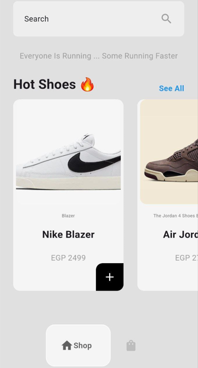
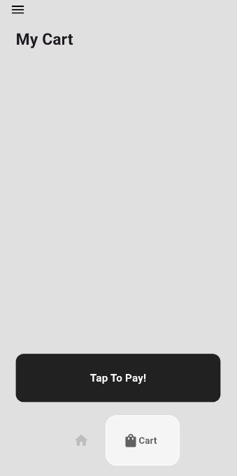
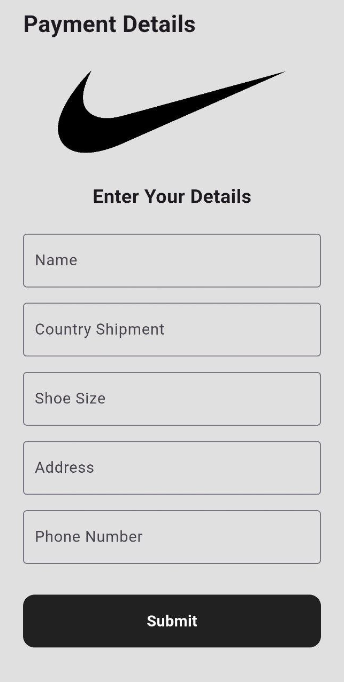

# Nike Store

My Nike Store app where innovation meets style and performance. Our store offers the latest and greatest in athletic footwear, apparel, and accessories for men, women, and kids. Discover cutting-edge technology in our sneakers designed for running, basketball, training, and everyday wear.

## What This App Contains:

- **Welcome Screen**
    - Where It Contains Nike Logo And Get Started
  
    

- **Shop Screen**
    - Where It Contains a Search Bar And Shoe Models, You Can Choose What Ever Do you By Pressing "+", And a Navigation Bar Where You Can Navigate Between the Shop Page And the Cart Page

    

- **Cart Screen**
    - After You Have chosen your Favorite Pair Of Shoes, they will be Transferred To a Cart Where You Can Pay For Them.
  
    

- **Payment Screen**
    - Here is Where The User Entered His Details: Name, Shoe Size, Address, Phone Number For Communication
    
    

## This App Created By :
* Name: Omar Abdullah Saeed 
* University: Cairo University
* Collage: Computer Science And Artificial intelligence
* Department: Artificial Inelegance 
